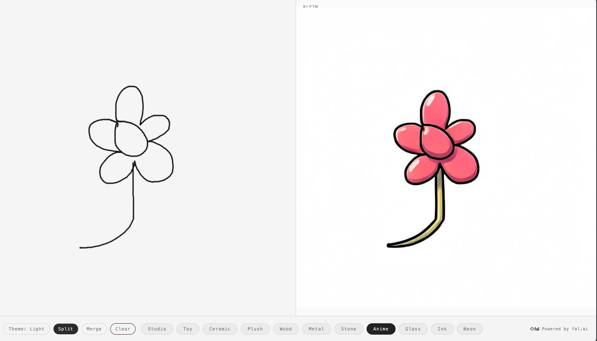

# Klein Realtime Sketch App

Realtime sketch-to-image web app powered by `fal-ai/flux-2/klein` realtime.



## Demo Video

<video src="./realtime%20canvas.mp4" controls width="900"></video>

If inline playback is unavailable on your viewer, open the file directly: [realtime canvas.mp4](./realtime%20canvas.mp4).

## Inspired By

- [Tomáš Procházka on X](https://x.com/tomasproc/status/2023769284384591913)

## Features

- Draw on canvas and get live generated output
- Style presets (`Studio`, `Toy`, `Ceramic`, `Plush`, `Wood`, `Metal`, `Stone`, `Anime`, `Glass`, `Ink`, `Neon`)
- `Split` and `Merge` modes
- Dark/Light theme toggle
- Secure server-side token generation for fal realtime

## Tech Stack

- Node.js + Express
- `@fal-ai/client` realtime WebSocket client
- Vanilla HTML/CSS/JS frontend

## Prerequisites

- Node.js 18+ (20+ recommended)
- A fal API key

## Local Setup

1. Install dependencies:

```bash
npm install
```

2. Create `.env` in project root:

```env
FAL_KEY=your_fal_api_key_here
PORT=3000
```

3. Start the app:

```bash
npm start
```

4. Open:

`http://localhost:3000`

## Deploy to Railway

### Option A: Deploy from GitHub (recommended)

1. Push this project to a GitHub repo.
2. In Railway, click **New Project** -> **Deploy from GitHub repo**.
3. Select your repo.
4. Add environment variable in Railway:
   - `FAL_KEY` = your fal API key
5. Railway should auto-detect Node and run `npm install`.
6. Set start command (if needed):
   - `npm start`
7. Deploy and open the generated Railway URL.

### Option B: Deploy with Railway CLI

1. Install Railway CLI:

```bash
npm i -g @railway/cli
```

2. Login and initialize:

```bash
railway login
railway init
```

3. Set env var:

```bash
railway variables set FAL_KEY=your_fal_api_key_here
```

4. Deploy:

```bash
railway up
```

5. Open deployed app:

```bash
railway open
```

## Environment Variables

- `FAL_KEY` (required): fal API key used by backend token endpoint.
- `PORT` (optional): server port (Railway injects this automatically).

## Scripts

- `npm start` - start production server
- `npm run dev` - run server with Node watch mode

## Notes

- `.env` is ignored by `.gitignore` so keys are not committed.
- Realtime connection uses short-lived tokens from `/api/fal/realtime-token`.
